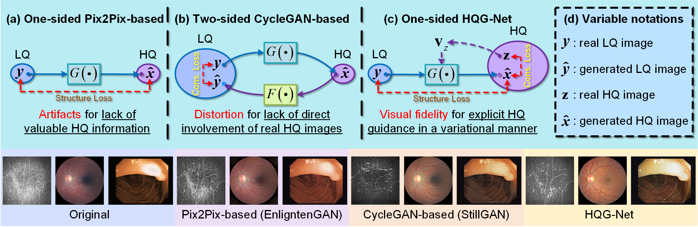
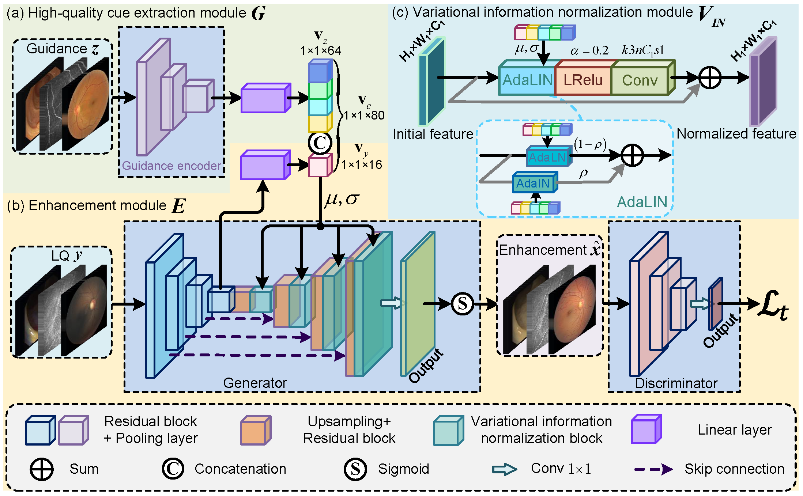

# HQG-Net_TNNLS
**HQG-Net: Unpaired Medical Image Enhancement with High-Quality Guidance**, TNNLS

[[Paper]](https://arxiv.org/abs/2307.07829) [[Datasets]](https://drive.google.com/drive/folders/154EsQMV3Cew8xF54YJEQ_euBimr0QLpx) [[Models]](https://drive.google.com/drive/folders/1DOI9HK4ZgDBBpLp_TLaS2Zywln6X_5hA)

#### Authors
[Chunming He](https://chunminghe.github.io/), [Kai Li*](http://kailigo.github.io/), Guoxia Xu, Longxiang Tang, [Jiangpeng Yan](https://yjump.github.io/), [Yulun Zhang](https://yulunzhang.com/), [Xiu Li*](https://scholar.google.com/citations?user=Xrh1OIUAAAAJ&hl=en), Yaowei Wang

---
> **Abstract:** *Unpaired Medical Image Enhancement (UMIE) aims to transform a low-quality (LQ) medical image into a high-quality (HQ) one without relying on paired images for training. While most existing approaches are based on Pix2Pix/CycleGAN and are effective to some extent, they fail to explicitly use HQ information to guide the enhancement process, which can lead to undesired artifacts and structural distortions. In this paper, we propose a novel UMIE approach that avoids the above limitation of existing methods by directly encoding HQ cues into the LQ enhancement process in a variational fashion and thus model the UMIE task under the joint distribution between the LQ and HQ domains. Specifically, we extract features from an HQ image and explicitly insert the features, which are expected to encode HQ cues, into the  enhancement network to guide the LQ enhancement with the variational normalization module. We train the enhancement network adversarially with a discriminator to ensure the generated HQ image falls into the HQ domain. We further propose a content-aware loss to guide the enhancement process with wavelet-based pixel-level and multi-encoder-based feature-level constraints. Additionally, as a key motivation for performing image enhancement is to make the enhanced images serve better for downstream tasks, we propose a bi-level learning scheme to optimize the UMIE task and downstream tasks cooperatively, helping generate HQ images both visually appealing and favorable for downstream tasks. Experiments on three medical datasets, including two newly collected datasets, verify that the proposed method outperforms existing techniques in terms of both enhancement quality and downstream task performance. We will make the code and the newly collected datasets publicly available for community study.*
>
> <p align="center">
> 
> </p>
> <p align="center">
> 
> </p>
---

## Environment
You can install all the requirements via:
```bash
pip install -r requirements.txt
```

## Train
```bash
python train.py
```

## Test
```bash
python demo.py
```


# Related Work
[Structure and illumination constrained GAN for medical image enhancement](https://github.com/iMED-Lab/StillGAN), TMI21.
# Citation

## Concat
If you have any questions, please feel free to contact me via email at chunminghe19990224@gmail.com or hcm21@mails.tsinghua.edu.cn.
